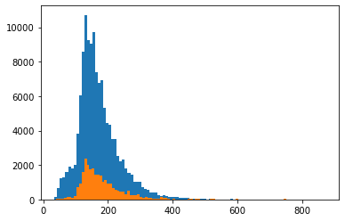

# BertQA-SQUAD2
A bert based model trained on the squad 2 dataset for question answering using hugging face and pytorch.

# Contexts' length histogram

The sequence length argument strongly corelates to the required memory usage and the corresponding batch size. We notice most contexts contain less than 30 words. Lesser values reduce the
model's accuracy since we exclude the needed information for the question to be answered.

  

# Model accuracy
Produced with the standford evaluation script

**exact**: 64.51612903225806

**f1**: 69.4742652718149

**total**: 11873

**HasAns_exact**: 61.11673414304993

**HasAns_f1**: 71.04722529896368

**HasAns_total**: 5928

**NoAns_exact**: 67.90580319596299

**NoAns_f1**: 67.90580319596299

**NoAns_total**: 5945

Within the notebook we test the model's accuracy on the TriviaQA dataset (trained and tested with / for it).

# Checkpoints
Since the training time is quite high due to the model's complexity, each epoch is saved inside a checkpoint folder that can be
loaded if needed for further retraining.

# Examples from trained model
(The following examples are taken from the notebook itself)

**Context**: SQuAD2.0 combines the 100,000 questions in SQuAD1.1 with over 50,000 unanswerable questions written adversarially by crowdworkers to look similar to answerable ones. To do well on SQuAD2.0, systems must not only answer questions when possible, but also determine when no answer is supported by the paragraph and abstain from answering.

**Question**: How many questions does squad 1 contain?

**Answer**: 100 , 000
- - - -
**Context**: Elon Reeve Musk FRS is an entrepreneur and business magnate. He is the founder, CEO, and Chief Engineer at SpaceX; early-stage investor, CEO, and Product Architect of Tesla, Inc.; founder of The Boring Company; and co-founder of Neuralink and OpenAI.

**Question**: Who is elon musk?

**Answer**: an entrepreneur and business magnate .
- - - -
**Context**: I don’t trust stairs because they’re always up to somethin

**Question**: Why dont i trust stairs?

**Answer**: they ’ re always up to somethin
- - - -
**Context**: Tetris is a puzzle video game created by Soviet software engineer Alexey Pajitnov in 1984. It has been published by several companies for multiple platforms, most prominently during a dispute over the appropriation of the rights in the late 1980s.

**Question**: When was tetris released?

**Answer**: 1984 .
